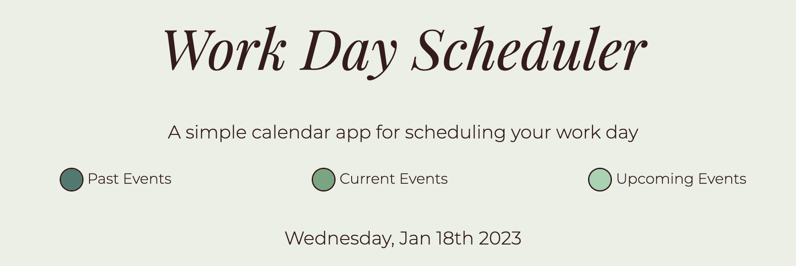
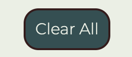

    

## 

The purpose of this project was to create a simple application to allow users to plan out their work day hour by hour. While using this application, users needed to be able to visually tell the difference between hours that have already passed, the current hour, and upcoming hours. Additionally, when the user enters and saves items in a specific time, those items needed to persist in the correct hour even when the user refreshes the page. These functions were created using moment.js to set and compare the hours, and by using local storage with the time slot acting as the key and the users input as the value.

## 

No Installation is necessary to use this application. The deployed page can be accessed at https://boushka9.github.io/free-lego-library/ .

## 

1. When the page loads you will be presented with the title 'Work Day Scheduler' with a color key indicating which colors represent past, current, and upcoming hours. Below the color key is the current date.

2. Scrolling down from the title you will see hourly rows starting at 8AM and ending at 5PM. To the right of each hour you can click to type in meeting reminders, to-do items, or other notes that you might need throughout your work day. 

3. To save your text inputs, click on the star at the right end of each row you entered text into. (it will grow and change color as you hover over it). This will stop you from losing your inputs when you refresh the page.

4. If you would like to clear all text fields simply scroll past the end of the hourly blocks to the green 'Clear All' button at the bottom of the page. Click the 'Clear All' page to clear your inputs and stop them from showing up when you refresh the page. 

## 

MIT

## 

    
     
    

